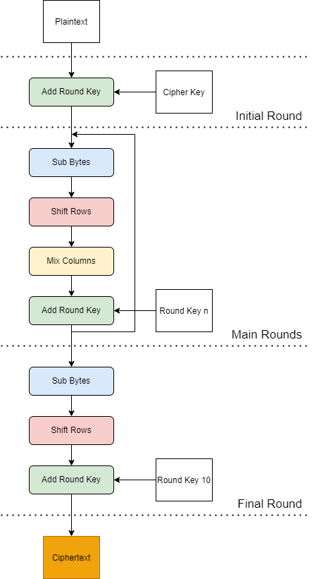
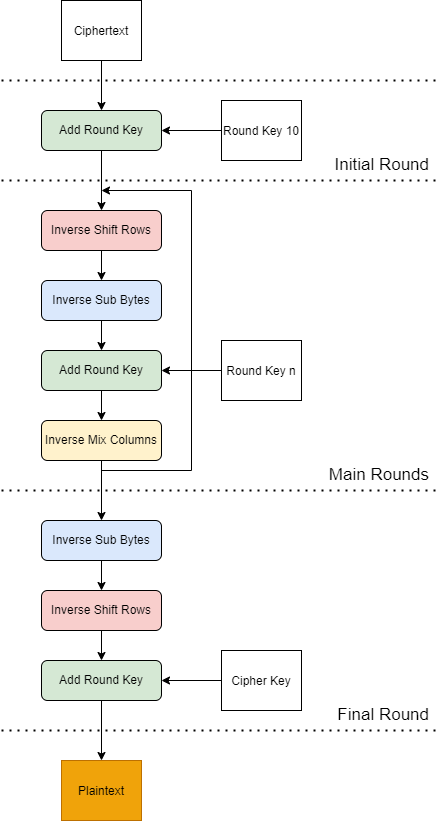

# VHDL Implementation of AES-128: Encryption and Decryption

## What is AES?

The Advanced Encryption Standard (AES) is a cryptographic algorithm used to encrypt and decrypt information. An encryption algorithm transforms the **Plaintext** (original data before encryption) into a **Ciphertext** (an unintelligble form of data), which can only be accessed using a **Cipher Key**. In the AES algorithm, the encryption and decryption stages use the same cipher key because it is a symmetric block cipher. For this implementation, both the length of the data input and the cipher key are set to 128 bits.

## Encryption:

The AES algorithm uses a series of iterations to encrypt the Plaintext into a Ciphertext. These are known as rounds. The next stage of the AES algorithm is determined by the output of the previous round. Descriptions of the various rounds can be seen below:

#### Initial Round:

The Initial round is the Add Round Key only, and takes the Plaintext and Cipher Key as inputs. The output of the initial round is mapped to the input of the first main round.

#### Main Round:

For each main round, there are 4 unique transformations: Sub-byte, Shift row, Mix Column and Add Round Key. A brief explanation of these can be seen below:

- Sub Bytes: Each byte of data is substituted with a byte from a fixed lookup table, the Sbox.

- Shift Rows: Each row of the input is rotated by an incrementing number of bytes.

- Mix Columns: Each column of the input is multiplied in Rijindael's Galois Field by a given matrix.

- Add Round Key: The input is XOR-ed with a unique round key. The Key Schedule is used to expand the cipher key to generate seperate Round Keys, which are needed to perform this function.

#### Final Round:

The Final Round consists of the Sub Bytes, Shift Rows and Add Round Key operations only. The Final Round outputs the Ciphertext.

#### Block Diagram:

## Decryption:

This process decrypts the Ciphertext back into its original Plaintext. The inverse operations of those mentioned in Encryption are used, and the order of the Round Keys are reversed. Descriptions of the various rounds used during Decryption can be seen below:

#### Inverse Initial Round:

Similar to Encryption, the Initial Round is the Add Round Key operation only.

#### Inverse Main Round:

The Inverse Main Round uses the inverse of the transformations in the Encryption process. These operations are also used in the following order:

- Inverse Shift Rows 
- Inverse Sub Bytes
- Add Round Key
- Inverse Mix Columns

#### Inverse Final Round:

The Inverse Final Round consists of the Inverse Sub Bytes, Inverse Shift Rows and Add Round Key operations only. The Inverse Final Round outputs the Plaintext.

#### Block Diagram:

### Useful links:

- FIPS (Federal Information Processing Standard) 197 can be found [here](https://nvlpubs.nist.gov/nistpubs/FIPS/NIST.FIPS.197.pdf)

- AES-128 Encryption explained as a [flash animation](https://formaestudio.com/rijndaelinspector/archivos/Rijndael_Animation_v4_eng-html5.html) (a version on youtube is available [here](https://www.youtube.com/watch?v=gP4PqVGudtg&t=48s))

- The AES Mixed Columns Operation is explained [here](https://www.angelfire.com/biz7/atleast/mix_columns.pdf)