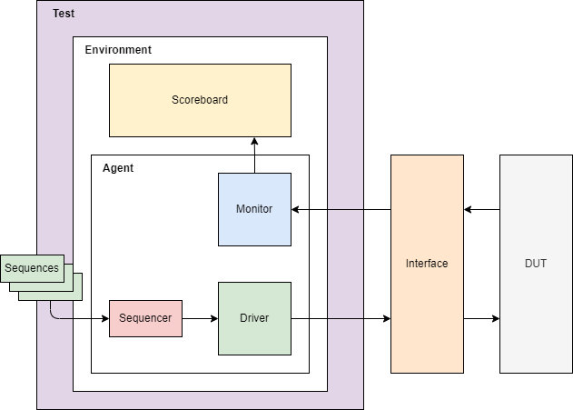
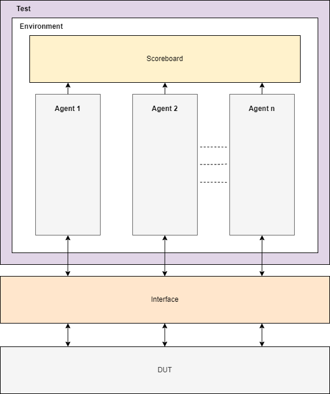

# SystemVerilog UVM Verification

## UVM Testbench block diagram (single Agent):

## UVM Testbench block diagram (multiple Agents):

### Test:

- Configures the Testbench.
- Builds the Environment.
- Initiates the stimulus by starting the sequence.

### Environment:

- Groups higher level components (such as Scoreboards and Agents).

### Agent:

- Groups UVM components to an interface/protocol.

The following components make up an Agent:

#### Sequences:

- Defines the order in which data needs to be generated and sent/received to/from the Driver.

#### Sequencer:

- Routes the sequences to the Driver or vice versa.

#### Driver:

- Drives the packet level data into the interface (and hence the DUT).

#### Monitor:

- Receives data from the DUT and sends to components such as a Scoreboard.

#### Scoreboard:

- Compares data received from monitor with expected values.
- These values can either be golden reference values, or generated from reference model.